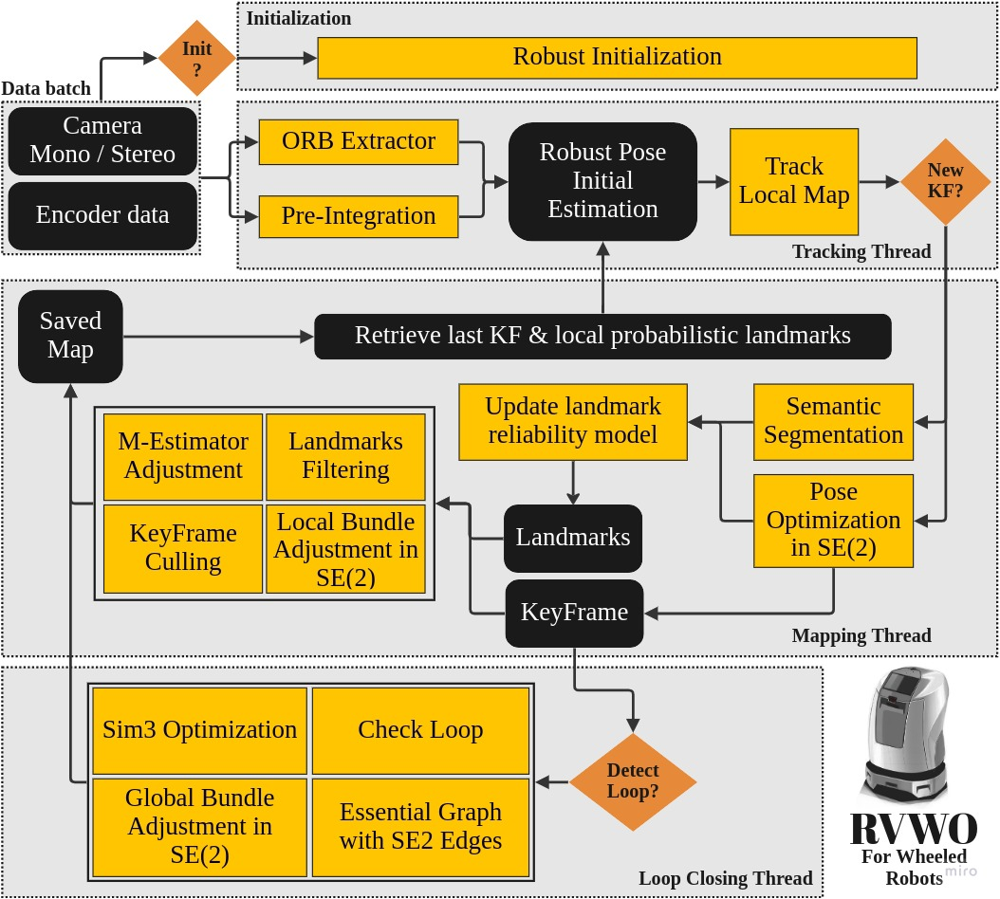

<h1 align="center">RVWO: A Robust Visual-Wheel SLAM System for Mobile Robots in Dynamic Environments</h1>

## Introduction
RVWO is a system designed to provide robust localization and mapping for wheeled mobile robots in challenging scenarios. The proposed approach leverages a probabilistic framework that incorporates semantic prior information about landmarks and visual re-projection error to create a landmark reliability model, which acts as an adaptive kernel for the visual residuals in optimization. Additionally, we fuse visual residuals with wheel odometry measurements, taking advantage of the planar motion assumption. The RVWO system is designed to be robust against wrong data association due to moving objects, poor visual texture, bad illumination, and wheel slippage. Evaluation results demonstrate that the proposed system shows competitive results in dynamic environments and outperforms existing approaches on both public benchmarks and on our custom hardware setup.

    

## Contributors
[Jaafar Mahmoud](https://github.com/JaafarMahmoud1), [Andrey Penkovskiy](https://github.com/WFram), [Long Vuong](https://github.com/hellovuong)

## Related video

Coming soon...

## Code & Dataset
Our paper is currently under review. The code and private dataset will be released once the paper is accepted.

## Acknowledgments
We would like to thank the [ORB-SLAM3](https://github.com/UZ-SLAMLab/ORB_SLAM3) developers for a great baseline system.